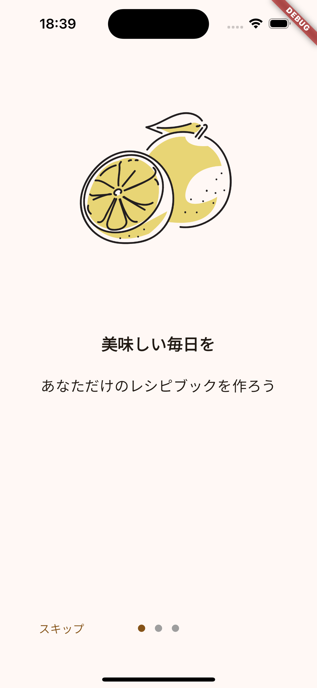
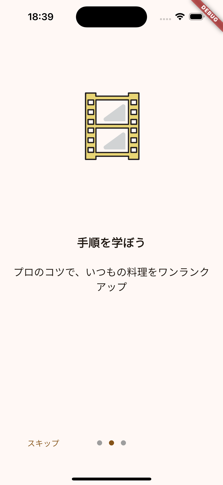
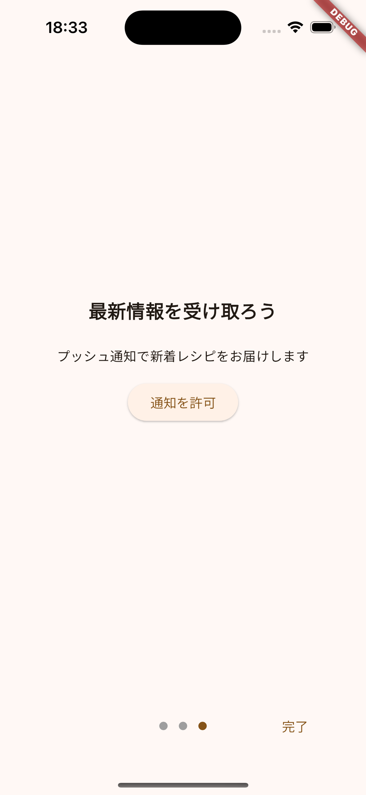

# buzz_recipe_viewer

[](https://github.com/yorifuji/buzz_recipe_viewer/actions/workflows/check.yml)

レシピ記録と動画を検索・閲覧するアプリです。

本アプリを通して Flutter アプリ開発におけるアーキテクチャの検討やライブラリ利用のスキルを習得することを目的にしています（技術 showcase）。

# Screenshot

| iOS                            |                                |                                |
| ------------------------------ | ------------------------------ | ------------------------------ |
|  |  |  |

| iOS                           |                               |
| ----------------------------- | ----------------------------- |
|  |  |
|  |  |

| Web（[デモサイト](https://buzz.yorifuji.dev/)） | macOS                         |
| ----------------------------------------------- | ----------------------------- |
|                    |  |

# Supported Platform

| Platform | Android | iOS | Web | macOS | Windows |
| -------- | ------- | --- | --- | ----- | ------- |
| Status   | ✅      | ✅  | ✅  | ✅    | N/A     |

# Development Environment

| Tool           | Version |
| -------------- | ------- |
| Flutter        | 3.24.1  |
| Xcode          | 15.3    |
| Android Studio |         |

# Architecture

Single Source of Truth(SSOT)とコマンドクエリ責務分離(CQRS)を意識した単方向データフロー


- Presentation
  - Widget など
- Store
  - 状態の保持、主に NotifierProvier で実装
  - State の更新は Service 経由で行う
  - Presentation から watch することで状態をリアクティブに UI に反映させる
- Service
  - UI の操作に基づいて帛紗を伴う処理を行う、主に Repository に対する操作を行う
  - 取得したデータに基づいて Store を更新する
  - 状態は持たない
- Repository
  - ストレージ・API・バックエンドとのインタフェース

# Directory

```
lib
├── i18n              # 国際化関連（slang）
├── model             # モデルの定義
├── provider          # クラスのインスタンスを提供する Provider の定義
├── repository        # データソース (API, DB)
├── service           # ビジネスロジックの実装
├── store             # 状態管理
└── ui                # UI
    ├── common        # 共通コンポーネント
    ├── error         # エラー画面
    ├── favorite      # お気に入り
    ├── navigation    # ナビゲーション
    ├── recipe        # レシピ
    ├── settings      # 設定
    ├── video         # 動画
    └── video_player  # 動画プレイヤー

```

# Dependencies

- Routing
  - [go_router](https://pub.dev/packages/go_router)
- DI
  - [Riverpod(v2, generator)](https://riverpod.dev/)
- Data store
  - [Firebase Firestore](https://firebase.google.com/docs/firestore)
  - [shared_preferences](https://pub.dev/packages/shared_preferences)
- UI
  - [custom_text](https://pub.dev/packages/custom_text)
  - [like_button](https://pub.dev/packages/like_button)
  - [settings_ui](https://pub.dev/packages/settings_ui)
  - [introduction_screen](https://pub.dev/packages/introduction_screen)
  - [flutter_inappwebview](https://pub.dev/packages/flutter_inappwebview)
  - [youtube_player_flutter](https://pub.dev/packages/youtube_player_flutter)
- i18n
  - [slang](https://pub.dev/packages/slang)
- Other
  - [freezed](https://pub.dev/packages/freezed)
  - [flutter_gen](https://pub.dev/packages/flutter_gen)
  - [url_launcher](https://pub.dev/packages/url_launcher)
  - [in_app_review](https://pub.dev/packages/in_app_review)
  - [flutter_dotenv](https://pub.dev/packages/flutter_dotenv)
  - [package_info_plus](https://pub.dev/packages/package_info_plus)
  - [flutter_launcher_icons](https://pub.dev/packages/flutter_launcher_icons)

## Dependency Management

- [Dependabot](https://docs.github.com/en/code-security/dependabot/working-with-dependabot)

# Backend

- [Firebase](https://firebase.google.com/)
  - [Authentication](https://firebase.google.com/products/auth)
  - [Firestore](https://firebase.google.com/docs/firestore)
  - [Cloud Messaging](https://firebase.google.com/docs/cloud-messaging)
- [Algolia](https://www.algolia.com/)

# Data Source

- 後述の別のリポジトリを使って YouTube の情報を定期的に取得して Algolia にインポートしている
- [YouTube Data API](https://developers.google.com/youtube/v3)

# Flavor

Android および iOS のみ対応、`--dart-define=FLAVOR=...` で切り替え

| Flavor | 用途         | 配布方法                  | BundleID prefix |
| ------ | ------------ | ------------------------- | --------------- |
| prod   | 本番用       | PlayConsole, TestFlight   |                 |
| stg    | ステージング | Firebase App Distribution | `.stg`          |
| dev    | 開発用       | ローカルビルド            | `.dev`          |

# Test

- Widget Test
- VRT(Visual Regression Testing)

# CI/CD

[GitHub Actions](https://github.co.jp/features/actions)を採用

- Check
  - flutter format
  - flutter analyze
- Test
  - flutter test
  - VRT(Visual Regression Testing)
- Bumpup
  - pubspec.yaml の`version:`のインクリメント
- Deliver(build & deploy)
  - development
  - staging
    - Firebase App Distribution
  - production
    - Google Play, App Store Connect(Test Flight)
  - pages
    - GitHub Pages
- Nightly build

# 素材

- https://loosedrawing.com/

# Related repository

- [yorifuji/buzz_recipe_importer](https://github.com/yorifuji/buzz_recipe_importer)
- YouTube のチャンネルの動画の情報を定期的に取得して Algolia にインポートする Python プログラム
- GitHub Actions で定期実行している
