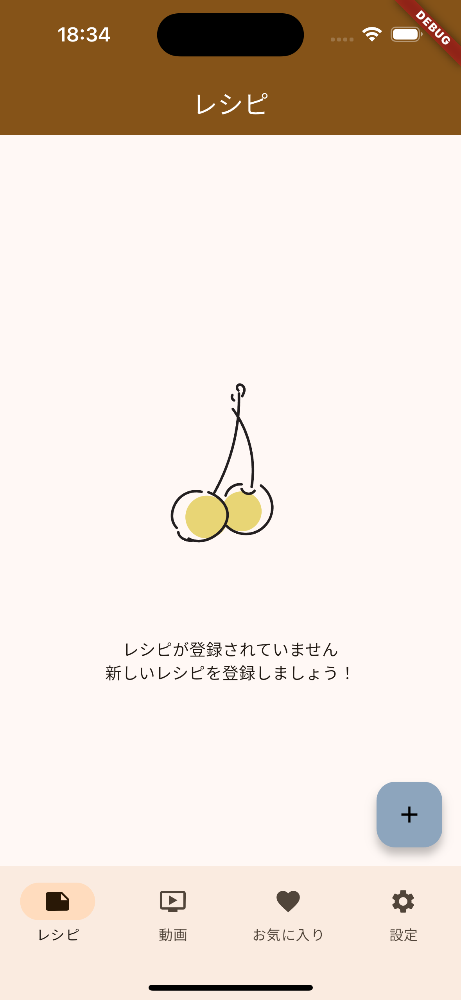

# buzz_recipe_viewer

| screenshot1                   | screenshot2                   |
| ----------------------------- | ----------------------------- |
|  |  |

# Architecture

- Flutter
  - MVVM + Repository
  - Dependencies
    - [Riverpod](https://riverpod.dev/)
    - [freezed](https://pub.dev/packages/freezed)
    - [Isar Database](https://isar.dev/ja/)
- Backend
  - [Algolia](https://www.algolia.com/)
- Data Source
  - [YouTube Data API](https://developers.google.com/youtube/v3)
- CI/CD
  - GitHub Actions
