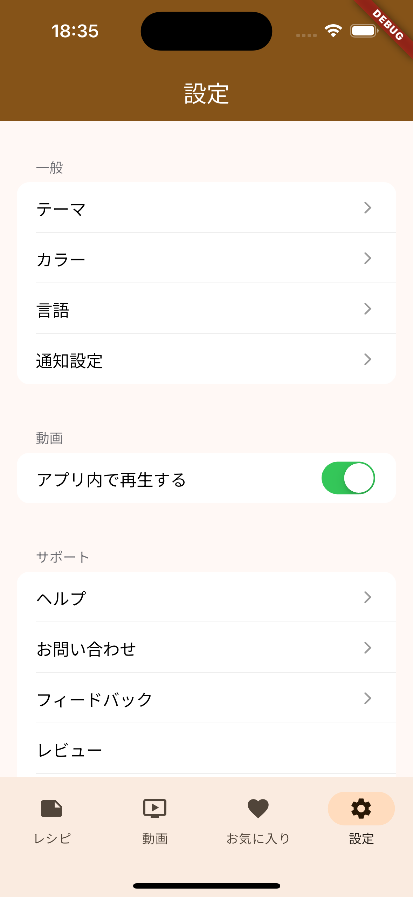

# buzz_recipe_viewer

レシピ記録と動画を検索・閲覧するアプリです。

本アプリを通して Flutter アプリ開発におけるアーキテクチャの検討やライブラリ利用のスキルを習得することを目的にしています（技術 showcase）。

# Screenshot

|                               |                               |
| ----------------------------- | ----------------------------- |
|  |  |
|  |  |

# Environment

| Tool           | Version |
| -------------- | ------- |
| Flutter        | 3.19.4  |
| Xcode          | 15.2    |
| Android Studio |         |

# Architecture

- Single Source of Truth(SSOT)とコマンドクエリ責務分離(CQRS)を意識した単方向データフロー

- Presentation
  - Widget など
- Store
  - 状態の保持、主に NotifierProvier で実装
  - State の更新は Service 経由で行う
  - Presentation から watch することで状態をリアクティブにUIに反映させる
- Service
  - UI の操作に基づいて処理を行う
    - 主に Repository に対する操作を行いデータを取得する
  - 取得したデータに基づいて Store を更新する
  - 状態は持たない
- Repository
  - 外部サービス、API、データベースなどのデータソースからデータを取得

# Dependencies

- DI
  - [Riverpod(v2, generator)](https://riverpod.dev/)
- Data store
  - [Isar Database](https://isar.dev/ja/)
  - [shared_preferences](https://pub.dev/packages/shared_preferences)
- UI
  - [youtube_player_flutter](https://pub.dev/packages/youtube_player_flutter)
  - [custom_text](https://pub.dev/packages/custom_text)
  - [settings_ui](https://pub.dev/packages/settings_ui)
  - [like_button](https://pub.dev/packages/like_button)
- i18n
  - [slang](https://pub.dev/packages/slang)
- Other
  - [freezed](https://pub.dev/packages/freezed)
  - [package_info_plus](https://pub.dev/packages/package_info_plus)
  - [flutter_dotenv](https://pub.dev/packages/flutter_dotenv)
  - [flutter_launcher_icons](https://pub.dev/packages/flutter_launcher_icons)
  - [url_launcher](https://pub.dev/packages/url_launcher)

## Dependency Management

- [Dependabot](https://docs.github.com/en/code-security/dependabot/working-with-dependabot)

# Backend

- [Algolia](https://www.algolia.com/)

# Data Source

- [YouTube Data API](https://developers.google.com/youtube/v3)
- 後述の別のリポジトリを使って YouTube の情報を定期的に取得して Algolia にインポートしている

# Flavor

`--dart-define=FLAVOR=...` を採用

- dev
  - 開発用（ローカルビルド）
  - リポジトリの一部をモックに差し替えている
  - BundleID:dev.yorifuji.buzz_recipe_viewer.dev
- stg
  - STG 配布（Firebase App Distribution）
  - dev.yorifuji.buzz_recipe_viewer.stg
- prod
  - 本番配布
  - dev.yorifuji.buzz_recipe_viewer

# Test

- Widget Test
- VRT(Visual Regression Testing)

# CI/CD

[GitHub Actions](https://github.co.jp/features/actions)を採用

- Check
  - flutter format
  - flutter analyze
  - コード生成のファイル差分のチェック（コミット漏れの検出）
- Test
  - flutter test
  - VRT(Visual Regression Testing)
- Bump
  - pubspec.yaml の`version:`のインクリメント
- Deliver(build & deploy)
  - stg
    - Firebase App Distribution
  - prod
    - Google Play, App Store Connect(Test Flight)
- Nightly build

# Related repository

- [yorifuji/buzz_recipe_importer](https://github.com/yorifuji/buzz_recipe_importer)
- YouTube のチャンネルの動画の情報を定期的に取得して Algolia にインポートする Python プログラム
- GitHub Actions で定期実行している
