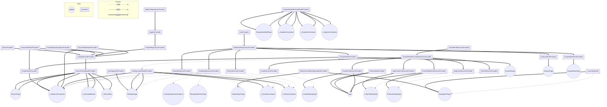

```mermaid
flowchart TB
subgraph Arrows
direction LR
start1[ ] -..->|read| stop1[ ]
style start1 height:0px;
style stop1 height:0px;
start2[ ] --->|listen| stop2[ ]
style start2 height:0px;
style stop2 height:0px;
start3[ ] ===>|watch| stop3[ ]
style start3 height:0px;
style stop3 height:0px;
end
subgraph Type
direction TB
ConsumerWidget((widget));
Provider[[provider]];
end

localePreferenceProvider[["localePreferenceProvider"]];
localeServiceProvider[["localeServiceProvider"]];
appColorPreferenceProvider[["appColorPreferenceProvider"]];
appColorServiceProvider[["appColorServiceProvider"]];
settingsViewModelProvider[["settingsViewModelProvider"]];
sharedPreferencesRepositoryProvider[["sharedPreferencesRepositoryProvider"]];
themeModePreferenceProvider[["themeModePreferenceProvider"]];
themeServiceProvider[["themeServiceProvider"]];
packageInfoProvider[["packageInfoProvider"]];
recipeNoteServiceProvider[["recipeNoteServiceProvider"]];
fullscreenVideoPlayingStateProvider[["fullscreenVideoPlayingStateProvider"]];
favoriteServiceProvider[["favoriteServiceProvider"]];
currentAppTab[["currentAppTab"]];
favoriteStoreProvider[["favoriteStoreProvider"]];
historyServiceProvider[["historyServiceProvider"]];
searchViewModelProvider[["searchViewModelProvider"]];
recipeServiceProvider[["recipeServiceProvider"]];
recipeStoreProvider[["recipeStoreProvider"]];
searchStateStoreProvider[["searchStateStoreProvider"]];
historyStoreProvider[["historyStoreProvider"]];
recipeNoteEditViewModelProvider[["recipeNoteEditViewModelProvider"]];
recipeNoteStoreProvider[["recipeNoteStoreProvider"]];
recipeRepositoryProvider[["recipeRepositoryProvider"]];
algoliaProvider[["algoliaProvider"]];
databaseRepositoryProvider[["databaseRepositoryProvider"]];
isarProvider[["isarProvider"]];
sharedPreferencesProvider[["sharedPreferencesProvider"]];
dotEnvRepositoryProvider[["dotEnvRepositoryProvider"]];
flavorProvider[["flavorProvider"]];
recipeRepositoryMockProvider[["recipeRepositoryMockProvider"]];
searchHitStoreProvider[["searchHitStoreProvider"]];
themeDataProvider[["themeDataProvider"]];
LocaleSettingPage((LocaleSettingPage));
ColorSettingPage((ColorSettingPage));
ThemeSettingPage((ThemeSettingPage));
SettingsPage((SettingsPage));
VideoPlayerPage((VideoPlayerPage));
NavigationPage((NavigationPage));
FavoritePage((FavoritePage));
\_FavoriteContainer((\_FavoriteContainer));
SearchPage((SearchPage));
\_VideoListContainer((\_VideoListContainer));
\_SortLabelButton((\_SortLabelButton));
\_SearchBox((\_SearchBox));
HistoryPage((HistoryPage));
\_HistoryContainer((\_HistoryContainer));
RecipeNoteEditPage((RecipeNoteEditPage));
\_HeadlineContainer((\_HeadlineContainer));
\_FoodListContainer((\_FoodListContainer));
\_StepListContainer((\_StepListContainer));
RecipeNotePage((RecipeNotePage));
\_RecipeNoteListContainer((\_RecipeNoteListContainer));
RecipeNoteViewPage((RecipeNoteViewPage));
App((App));

localePreferenceProvider ==> LocaleSettingPage;
localeServiceProvider -.-> LocaleSettingPage;
appColorPreferenceProvider ==> ColorSettingPage;
appColorServiceProvider -.-> ColorSettingPage;
themeModePreferenceProvider ==> ThemeSettingPage;
themeServiceProvider -.-> ThemeSettingPage;
packageInfoProvider ==> SettingsPage;
settingsViewModelProvider ==> SettingsPage;
settingsViewModelProvider ==> SettingsPage;
recipeNoteServiceProvider -.-> SettingsPage;
fullscreenVideoPlayingStateProvider ==> VideoPlayerPage;
favoriteServiceProvider -.-> VideoPlayerPage;
currentAppTab ==> NavigationPage;
fullscreenVideoPlayingStateProvider ==> NavigationPage;
currentAppTab -.-> NavigationPage;
favoriteStoreProvider ==> FavoritePage;
settingsViewModelProvider ==> \_FavoriteContainer;
historyServiceProvider -.-> \_FavoriteContainer;
favoriteServiceProvider -.-> \_FavoriteContainer;
searchViewModelProvider ==> SearchPage;
searchViewModelProvider ==> SearchPage;
searchViewModelProvider ==> \_VideoListContainer;
recipeStoreProvider ==> \_VideoListContainer;
searchViewModelProvider ==> \_VideoListContainer;
searchStateStoreProvider ==> \_VideoListContainer;
settingsViewModelProvider ==> \_VideoListContainer;
historyServiceProvider -.-> \_VideoListContainer;
favoriteServiceProvider -.-> \_VideoListContainer;
favoriteServiceProvider -.-> \_VideoListContainer;
searchViewModelProvider ==> \_SortLabelButton;
searchViewModelProvider ==> \_SortLabelButton;
searchViewModelProvider ==> \_SearchBox;
searchViewModelProvider ==> \_SearchBox;
historyStoreProvider ==> HistoryPage;
settingsViewModelProvider ==> \_HistoryContainer;
favoriteServiceProvider -.-> \_HistoryContainer;
historyServiceProvider -.-> \_HistoryContainer;
recipeNoteEditViewModelProvider ==> RecipeNoteEditPage;
recipeNoteEditViewModelProvider ==> RecipeNoteEditPage;
recipeNoteEditViewModelProvider ==> \_HeadlineContainer;
recipeNoteEditViewModelProvider ==> \_HeadlineContainer;
recipeNoteEditViewModelProvider ==> \_HeadlineContainer;
recipeNoteEditViewModelProvider ==> \_FoodListContainer;
recipeNoteEditViewModelProvider ==> \_FoodListContainer;
recipeNoteEditViewModelProvider ==> \_StepListContainer;
recipeNoteEditViewModelProvider ==> \_StepListContainer;
recipeNoteStoreProvider ==> RecipeNotePage;
recipeNoteServiceProvider -.-> \_RecipeNoteListContainer;
recipeNoteServiceProvider -.-> RecipeNoteViewPage;
themeDataProvider ==> App;
themeDataProvider ==> App;
themeModePreferenceProvider ==> App;
localePreferenceProvider ==> App;
sharedPreferencesRepositoryProvider ==> localePreferenceProvider;
sharedPreferencesRepositoryProvider ==> localeServiceProvider;
sharedPreferencesRepositoryProvider ==> appColorPreferenceProvider;
sharedPreferencesRepositoryProvider ==> appColorServiceProvider;
sharedPreferencesRepositoryProvider -.-> settingsViewModelProvider;
sharedPreferencesProvider ==> sharedPreferencesRepositoryProvider;
sharedPreferencesRepositoryProvider ==> themeModePreferenceProvider;
sharedPreferencesRepositoryProvider ==> themeServiceProvider;
databaseRepositoryProvider ==> recipeNoteServiceProvider;
databaseRepositoryProvider ==> favoriteServiceProvider;
databaseRepositoryProvider ==> favoriteStoreProvider;
databaseRepositoryProvider ==> historyServiceProvider;
recipeServiceProvider ==> searchViewModelProvider;
flavorProvider ==> recipeServiceProvider;
recipeRepositoryMockProvider ==> recipeServiceProvider;
recipeRepositoryProvider ==> recipeServiceProvider;
searchHitStoreProvider ==> recipeServiceProvider;
searchStateStoreProvider ==> recipeServiceProvider;
searchHitStoreProvider ==> recipeStoreProvider;
favoriteStoreProvider ==> recipeStoreProvider;
databaseRepositoryProvider ==> historyStoreProvider;
databaseRepositoryProvider ==> recipeNoteStoreProvider;
algoliaProvider ==> recipeRepositoryProvider;
dotEnvRepositoryProvider ==> algoliaProvider;
isarProvider ==> databaseRepositoryProvider;
```
